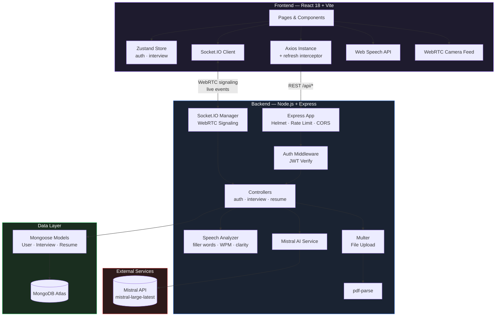
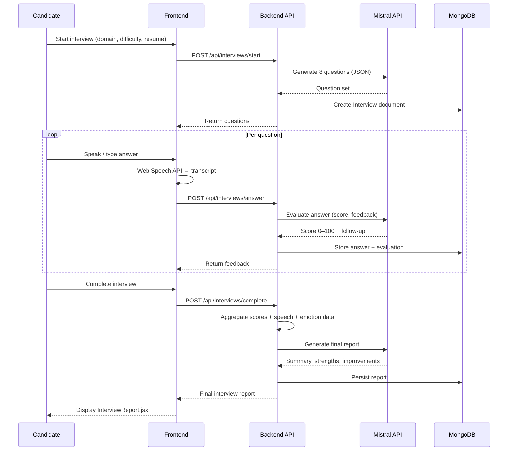
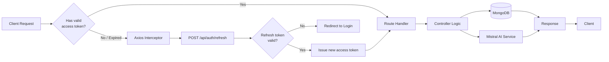
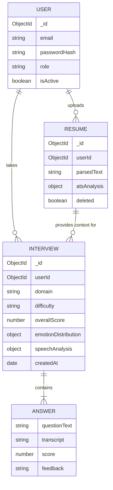

# NexusAI — AI Interview Simulator

> A production-ready, full-stack AI-powered interview preparation platform with real-time speech recognition, emotion detection, ATS resume scoring, and comprehensive performance analytics.


<p align="center">
  
  
  
  
</p>

---

## Table of Contents

- [Overview](#overview)
- [Features](#features)
- [Architecture](#architecture)
- [Tech Stack](#tech-stack)
- [Project Structure](#project-structure)
- [Installation](#installation)
- [Environment Variables](#environment-variables)
- [API Documentation](#api-documentation)
- [Running Locally](#running-locally)
- [Production Deployment](#production-deployment)
- [Key Implementation Details](#key-implementation-details)
- [Future Improvements](#future-improvements)
- [License](#license)

---

## Overview

NexusAI is a MERN-stack interview simulator that pairs candidates with an AI interviewer powered by Mistral. It records video and voice in real time, tracks facial emotions via simulation, analyzes speech patterns, scores resumes against job descriptions with an ATS engine, and delivers post-interview reports with actionable feedback.

---

## Features

- **AI Interview Engine** — Mistral-powered question generation, adaptive follow-ups, and per-answer evaluation
- **Voice Interaction** — Browser-native Speech Recognition API for real-time transcription
- **WebRTC Video** — Camera feed with in-browser recording and live emotion overlay
- **Emotion Detection** — Simulated facial emotion tracking (confident / nervous / happy / neutral / confused)
- **Resume Parser** — Upload PDF/DOCX; AI extracts skills, experience, education, and certifications
- **ATS Scoring** — Compare resume vs. job description; keyword matching, section scores, and fix suggestions
- **Analytics Dashboard** — Score trends, radar charts, domain breakdown, and emotion distribution
- **JWT Auth** — Secure register/login with refresh token rotation
- **Admin Panel** — User management, system health, and interview analytics
- **Dark Glassmorphism UI** — Framer Motion animations, Recharts data visualization

---

## Architecture

### System Overview



### AI Interview Pipeline

Each interview flows through three distinct Mistral calls, orchestrated by the backend `ai/` service.



### Request Lifecycle & Auth Flow



### Data Model (Simplified)



---

## Tech Stack

### Frontend

| Layer         | Technology                         |
| ------------- | ---------------------------------- |
| Framework     | React 18 + Vite                    |
| Styling       | Tailwind CSS v3                    |
| Routing       | React Router DOM v6                |
| State         | Zustand (persist middleware)       |
| HTTP          | Axios (with interceptor refresh)   |
| Realtime      | Socket.IO Client                   |
| Charts        | Recharts                           |
| Animation     | Framer Motion                      |
| Speech        | Web Speech API (SpeechRecognition) |
| Notifications | React Hot Toast                    |

### Backend

| Layer       | Technology                           |
| ----------- | ------------------------------------ |
| Runtime     | Node.js (ESM)                        |
| Framework   | Express.js                           |
| Database    | MongoDB + Mongoose                   |
| Auth        | JWT (access + refresh tokens)        |
| Realtime    | Socket.IO                            |
| File Upload | Multer                               |
| PDF Parsing | pdf-parse                            |
| AI          | Gemini API (gemini-3.6-flash)        |
| NLP         | Natural                              |
| Security    | Helmet, express-rate-limit, bcryptjs |

---

## Project Structure

```bash
ai-interview-simulator/
├── frontend/
│   ├── src/
│   │   ├── api/            # Axios instance with interceptors
│   │   ├── components/
│   │   │   ├── common/     # LoadingScreen
│   │   │   └── ui/         # ScoreRing, StatCard
│   │   ├── layouts/        # DashboardLayout, AuthLayout
│   │   ├── pages/
│   │   │   ├── Landing.jsx
│   │   │   ├── Login.jsx
│   │   │   ├── Register.jsx
│   │   │   ├── Dashboard.jsx
│   │   │   ├── StartInterview.jsx
│   │   │   ├── InterviewSession.jsx
│   │   │   ├── InterviewReport.jsx
│   │   │   ├── ResumeUpload.jsx
│   │   │   ├── ATSAnalysis.jsx
│   │   │   ├── History.jsx
│   │   │   ├── Analytics.jsx
│   │   │   ├── Profile.jsx
│   │   │   └── admin/
│   │   │       ├── AdminDashboard.jsx
│   │   │       └── AdminUsers.jsx
│   │   ├── store/          # Zustand stores (auth, interview)
│   │   └── styles/         # globals.css (Tailwind + custom)
│   ├── index.html
│   ├── vite.config.js
│   ├── tailwind.config.js
│   └── package.json
│
└── backend/
    └── src/
        ├── ai/             # Mistral API service
        ├── controllers/    # auth, interview, resume
        ├── middleware/     # auth, errorHandler
        ├── models/         # User, Interview, Resume
        ├── routes/         # auth, interview, resume, analytics, admin, user
        ├── sockets/        # Socket.IO manager (WebRTC signaling)
        ├── speech/         # Speech analyzer (filler words, clarity)
        ├── app.js
        └── server.js
```

---

## Installation

### Prerequisites

- Node.js ≥ 18
- MongoDB Atlas account (or local MongoDB)
- Gemini API key — [Google Console](https://aistudio.google.com)

### 1. Clone the repository

```bash
git clone https://github.com/Tanishq-Mathur35/NexusAI.git
cd NexusAI
```

### 2. Backend setup

```bash
cd backend
cp .env.example .env
# Fill in your values in .env
npm install
npm run dev
```

### 3. Frontend setup

```bash
cd frontend
cp .env.example .env
npm install
npm run dev
```

The app will be available at `http://localhost:5173`.

---

## Environment Variables

### Backend (`backend/.env`)

```env
PORT=5000
MONGODB_URI=mongodb+srv://<user>:<pass>@cluster.mongodb.net/ai-interview-simulator
JWT_SECRET=<long-random-secret>
JWT_REFRESH_SECRET=<another-long-random-secret>
JWT_EXPIRE=7d
JWT_REFRESH_EXPIRE=30d

GOOGLE_API_KEY=<your-google-api-key>
GEMINI_MODEL=gemini-2.5-flash

CLIENT_URL=http://localhost:5173
NODE_ENV=development
```

### Frontend (`frontend/.env`)

```env
VITE_API_URL=http://localhost:5000/api
VITE_SOCKET_URL=http://localhost:5000
```

---

## API Documentation

### Auth

| Method | Endpoint             | Description              |
| ------ | -------------------- | ------------------------ |
| POST   | `/api/auth/register` | Create account           |
| POST   | `/api/auth/login`    | Login, receive tokens    |
| POST   | `/api/auth/logout`   | Invalidate refresh token |
| POST   | `/api/auth/refresh`  | Rotate access token      |
| GET    | `/api/auth/me`       | Get current user         |

### Interviews

| Method | Endpoint                   | Description                          |
| ------ | -------------------------- | ------------------------------------ |
| POST   | `/api/interviews/start`    | Generate questions & start session   |
| POST   | `/api/interviews/answer`   | Submit answer, receive AI evaluation |
| POST   | `/api/interviews/complete` | Finalize, generate report            |
| GET    | `/api/interviews`          | Paginated history                    |
| GET    | `/api/interviews/stats`    | Aggregate stats                      |
| GET    | `/api/interviews/:id`      | Single interview detail              |

### Resume

| Method | Endpoint             | Description                         |
| ------ | -------------------- | ----------------------------------- |
| POST   | `/api/resume/upload` | Upload PDF/DOCX, parse with AI      |
| GET    | `/api/resume`        | List user resumes                   |
| GET    | `/api/resume/:id`    | Single resume                       |
| POST   | `/api/resume/ats`    | Run ATS analysis vs job description |
| DELETE | `/api/resume/:id`    | Soft-delete resume                  |

### Analytics

| Method | Endpoint                  | Description                |
| ------ | ------------------------- | -------------------------- |
| GET    | `/api/analytics/overview` | Score trends, domain stats |
| GET    | `/api/analytics/emotions` | Emotion distribution       |

### Admin (requires admin role)

| Method | Endpoint                      | Description              |
| ------ | ----------------------------- | ------------------------ |
| GET    | `/api/admin/stats`            | Platform-wide stats      |
| GET    | `/api/admin/users`            | Paginated user list      |
| PATCH  | `/api/admin/users/:id/toggle` | Activate/deactivate user |
| GET    | `/api/admin/interviews`       | All interviews           |

---

## Running Locally

```bash
# Terminal 1 — Backend
cd backend && npm run dev

# Terminal 2 — Frontend
cd frontend && npm run dev
```

Default demo credentials:

```
Email: admin@nexus.ai
Password: password123
```

> ⚠️ Change or remove these demo credentials before deploying to any public environment.

---

## Production Deployment

### Backend (Railway / Render / EC2)

```bash
cd backend
npm start
```

Set all environment variables in your hosting dashboard. Ensure `NODE_ENV=production` and `CLIENT_URL` matches your frontend domain.

### Frontend (Vercel / Netlify)

```bash
cd frontend
npm run build
# Deploy the dist/ folder
```

Set `VITE_API_URL` and `VITE_SOCKET_URL` to your production backend URL.

### MongoDB Atlas

1. Create a free M0 cluster at [mongodb.com/cloud/atlas](https://www.mongodb.com/cloud/atlas)
2. Whitelist your server IP or use `0.0.0.0/0` for development
3. Copy the connection string into `MONGODB_URI`

---

## Key Implementation Details

### AI Pipeline

Each interview flows through three Gemini calls (see [sequence diagram](#ai-interview-pipeline) above):

1. **Question generation** — domain + difficulty + optional resume context → 8 JSON questions
2. **Answer evaluation** — per question, returns score 0–100, feedback, and optional follow-up
3. **Report generation** — aggregated scores + speech + emotion → summary, strengths, improvements

### ATS Engine

The ATS scoring compares tokenized resume text against the job description using keyword frequency matching, then calls Mistral for semantic analysis and section-level scoring (skills, experience, education, formatting, keywords).

### Speech Analysis

The backend `speechAnalyzer.js` detects filler words, estimates words-per-minute, counts sentence pauses, and computes a clarity score using positive/negative word sentiment weighting — all without external APIs.

### WebRTC & Sockets

Socket.IO handles WebRTC signaling (offer/answer/ICE candidates) and live interview events (emotion updates, transcript streaming) through namespaced rooms per interview session.

---

## Future Improvements

- [ ] Real face-api.js / TensorFlow.js integration replacing emotion simulation
- [ ] Google Speech-to-Text API for higher accuracy transcription
- [ ] Cloudinary integration for video upload and storage
- [ ] Interview scheduling with calendar invite emails
- [ ] Peer interview mode (two users via WebRTC)
- [ ] Company-specific question banks
- [ ] Mobile app (React Native)
- [ ] GitHub Actions CI/CD pipeline
- [ ] Stripe billing for premium tiers
